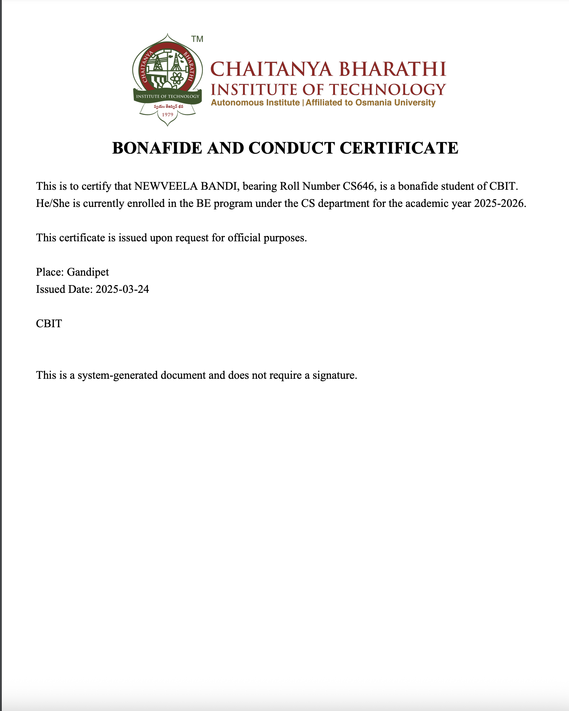

## Project Documentation: Bonafide Certificate Generator

### Project Title
**Bonafide Certificate Generator**

---

### Overview

The **Bonafide Certificate Generator** is a Spring Boot-based web application that allows an institution to:

- Create student profiles.
- View all registered students.
- Generate and download a Bonafide Certificate (in PDF format) for any student based on their ID.

The app is affiliated with **Chaitanya Bharathi Institute of Technology** and reflects a real-time use case of issuing student certificates.

---

### Tech Stack

| Layer       | Technology                    |
|------------|-------------------------------|
| Backend     | Spring Boot (Java)            |
| Frontend    | HTML, CSS, JavaScript         |
| PDF Gen     | iText (in `PDFGeneratorService`) |
| Build Tool  | Maven                         |
| Server      | Embedded Tomcat (via Spring Boot) |

---

### Project Structure

```
BonafideGenerator/
├── src/
│   ├── main/
│   │   ├── java/com/newveela/bonafidegenerator/
│   │   │   ├── controller/
│   │   │   ├── model/
│   │   │   ├── repository/
│   │   │   └── service/
│   │   ├── resources/
│   │   │   ├── static/
│   │   │   │   ├── index.html
│   │   │   │   ├── createStudent.html
│   │   │   │   ├── allstudents.html
│   │   │   │   ├── script.js
│   │   │   │   └── style.css
├── images/ (Screenshots of UI and workflow)
├── pom.xml (Maven configuration)
```

---

###  Functionalities

####  1. Create Student
- Form accepts:
  - Student Name
  - Department
  - Course Name
- Backend saves student record to database.
- Confirmation message shown on success.

####  2. View All Students
- Displays a list of all students with:
  - Student ID (clickable for download)
  - Name
  - Department
  - Course Name
  - Issue Date
- Clicking Student ID opens a confirmation popup before PDF download.

#### 3. Generate Certificate (via ID)
- Homepage input field allows entering Student ID manually.
- Confirmation popup shown before download.
- PDF gets generated dynamically and downloaded.

---

### Sample PDF Output
- Auto-generated with student info
- Shows name, roll number, department, course, and academic year
- Contains CBIT branding and issuance details

 Refer to `BonafidePdf.png` for example output.

---

###  How to Run the Project

```bash
# Step 1: Clone the repository
git clone https://github.com/newveela/BonafideGenerator.git
cd BonafideGenerator

# Step 2: Build the project
./mvnw clean install

# Step 3: Run the Spring Boot application
./mvnw spring-boot:run

# Step 4: Open the app in browser
http://localhost:8080/index.html
```

---

###  Screenshots

## Homepage:


---

##  Create Student:


---

##  View All Students:


---

## Download Confirmation Popup:


---

##  Download Dialog:


---

##  Sample Bonafide Certificate PDF:



---

###  Confirmation Popup Example:

When a user clicks on the "Generate Certificate" button or student ID, the following confirmation appears:

> _"Do you want to download the certificate for Student ID: CS646?"_

If the user clicks OK, the download is triggered.

---

### Future Improvements

- Add database integration (currently assumed in-memory or JPA).
- Search functionality on the "View All Students" page.
- Admin login for security.
- Enhanced UI with frameworks like React or Bootstrap.
- Email delivery of certificates.

---
